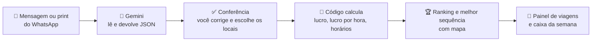
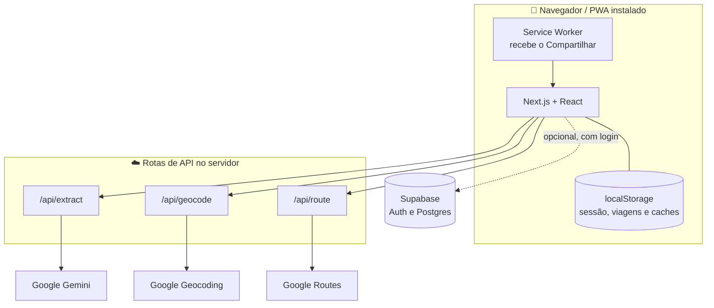

<div align="center">


<br/>


### Cole a mensagem do WhatsApp. Descubra em segundos qual carga, ou qual sequência de cargas, deixa mais dinheiro no bolso.

<br/>


</div>

---

## Índice

- [A ideia](#-a-ideia)
- [Como funciona](#-como-funciona)
- [Funcionalidades](#-funcionalidades)
- [A conta que o app faz](#-a-conta-que-o-app-faz)
- [Melhor sequência de cargas](#-melhor-sequência-de-cargas)
- [Tecnologias](#-tecnologias)
- [Arquitetura](#-arquitetura)
- [Estrutura de pastas](#-estrutura-de-pastas)
- [Como rodar](#-como-rodar)
- [Configurar o Supabase (opcional)](#-configurar-o-supabase-opcional)
- [Publicar na Vercel e instalar no celular](#-publicar-na-vercel-e-instalar-no-celular)
- [Testes](#-testes)
- [Decisões de projeto](#-decisões-de-projeto)
- [Limitações conhecidas](#-limitações-conhecidas)
- [Roadmap](#-roadmap)
- [Problemas comuns](#-problemas-comuns)

---

## 🚛 A ideia

Caminhoneiro autônomo recebe dezenas de ofertas de frete por dia em grupos de WhatsApp, quase
sempre assim: um nome de mina ou pedreira, um destino, uma tarifa e um horário. Faltam duas
coisas para decidir bem:

1. **Onde fica cada lugar?** As mensagens dizem "Extrativa", "Rocha", "Cedro Mariana", nunca
   um endereço.
2. **Quanto sobra de verdade?** O frete mais alto nem sempre é o melhor. Uma carga que paga
   R$ 1.350 mas exige 120 km rodando vazio pode deixar menos dinheiro (e ocupar mais horas) do
   que outra de R$ 1.200 com o caminhão quase ao lado.

O **FreteMax** resolve isso. Ele lê a mensagem (texto ou print), reconhece os lugares
que você já cadastrou, calcula o **lucro real** de cada carga considerando km vazio, km cheio,
diesel, pedágio, manutenção e tempo, e mostra **qual compensa mais**. Vai além: com dez propostas
na mão, ele monta a **melhor sequência** (casa → carga → carga → carga → casa), como um
motorista experiente faria de cabeça, só que testando todas as combinações.

> [!NOTE]
> Projeto criado para o dia a dia de um caminhoneiro de Minas Gerais, pensado para uso **no
> celular, com uma mão, ao ar livre**: alto contraste, botões grandes, números enormes.

---

## 🧠 Como funciona

O princípio central: **a IA lê, o código calcula.** Modelos de linguagem erram aritmética e
custam mais caro para fazer conta; por isso o Gemini só transforma texto em dados estruturados,
e todo o resto (distância, diesel, lucro, horários, ranking) é código normal, testado e
auditável. O resultado é sempre o mesmo para a mesma entrada.



---

## ✨ Funcionalidades

### 📥 Entrada e leitura

| | Recurso | Detalhe |
|---|---|---|
| 📝 | **Texto ou print** | Cole várias divulgações seguidas ou anexe vários prints. A IA separa cada rota, com origem, destino, preço, pedágio, horários e observações. |
| 📲 | **Compartilhar do WhatsApp** | No Android, com o app instalado, o FreteMax aparece na lista de compartilhamento. A mensagem chega direto na tela de Cargas. |
| 🗜️ | **Compressão de imagem** | Prints são reduzidos no navegador (até 1600 px) antes do envio, para gastar menos do plano de dados. |
| 🔎 | **Conferência antes de calcular** | Tudo o que a IA entendeu pode ser corrigido. O que foi *deduzido* (unidade, pedágio, preço ausente) aparece em amarelo. |
| 📍 | **Escolha do local certo** | Três mineradoras em Sete Lagoas? Escolha qual é a certa, veja o endereço e abra no mapa. Dá para cadastrar um local novo ali mesmo e "lembrar" o nome para a próxima vez. |

### 🧮 Análise

| | Recurso | Detalhe |
|---|---|---|
| 💰 | **Lucro por carga** | Frete − diesel − manutenção − pedágio, com **lucro por hora** e por km. |
| 🕒 | **Viabilidade de horário** | Se a carga exige carregar até 11:30 e você só chega 12:15, ela é marcada como inviável ou apertada. |
| ⚖️ | **Comparação lado a lado** | Tabela com lucro, tempo, diesel e pedágio. Mostra quando a carga que paga menos vence por render mais por hora. |
| 🏆 | **Melhor sequência** | Testa todas as ordens de 2 a 5 cargas em fila e mostra as 3 melhores, com a explicação em português. |
| 🗺️ | **Mapa da rota** | Trecho vazio tracejado, trecho cheio em linha grossa, botão para abrir a navegação no Google Maps. |
| ⚠️ | **Alertas de bom senso** | Consumo zerado, carga acima da capacidade, frete suspeito, viagem de mais de 48 h e prejuízo forte. |

### 📒 Controle financeiro

| | Recurso | Detalhe |
|---|---|---|
| ✅ | **Escolher e registrar** | Salva o retrato financeiro da carga (ou das cargas da sequência) no Painel. |
| 📊 | **Painel da semana** | Lucro líquido, receita, diesel, pedágio, manutenção reservada, gráfico por dia e lista de viagens. |
| ✍️ | **Concluir com valores reais** | Ao terminar a viagem, informe receita, diesel e pedágio reais e compare com o previsto. |
| 📤 | **Exportar** | Planilha CSV da semana ou de todas as viagens, e backup completo em JSON (caminhão, locais e viagens). |

### 🔁 Dados, memória e sincronização

| | Recurso | Detalhe |
|---|---|---|
| 💾 | **A análise não some** | Sair para Caminhão ou Locais e voltar (ou fechar e reabrir o app) mantém tudo por 24 h. |
| 🧠 | **Memória da IA** | A mesma mensagem enviada de novo reaproveita a leitura anterior, sem chamar o Gemini. |
| 🛣️ | **Memória de rotas** | Cada trecho A→B é consultado ao Google uma única vez e fica guardado por 60 dias. |
| ☁️ | **Conta opcional** | Login por link mágico (sem senha) e sincronização de Caminhão e Locais entre aparelhos. Sem login, tudo continua funcionando só no aparelho. |
| 📶 | **Local-first** | Salvar e editar nunca espera a rede. Se a conexão cair com o app aberto, uma faixa avisa e ele segue com o que já está guardado. Ler mensagens novas e consultar rotas novas precisa de internet. |

---

## 🧮 A conta que o app faz

Toda a matemática está em [`lib/calc.ts`](lib/calc.ts) e é coberta por testes.

| Item | Como é calculado |
|---|---|
| **Receita** | `valor × toneladas` (frete por tonelada) ou o valor fixo (frete por viagem). Valor sem unidade é tratado como por tonelada, com aviso na tela. |
| **Diesel** | `km cheio ÷ consumo cheio × preço` + `(km vazio + km da volta) ÷ consumo vazio × preço` |
| **Manutenção** | `km total × R$/km` (pneus, óleo, peças e desgaste, configurado em Caminhão) |
| **Pedágio** | O trecho vazio e a volta são sempre seus. O trecho cheio só entra se o pedágio **não** for reembolsado. Dá para digitar o valor real de cada carga. |
| **Tempo** | `(min vazio + min cheio + min volta) × fator do caminhão ÷ 60` + tempo de carga + tempo de descarga |
| **Lucro** | `receita − diesel − manutenção − pedágio` |
| **Lucro por hora** | `lucro ÷ tempo total`, o indicador que mais pesa, porque tempo rodando vazio é dinheiro perdido |
| **Viabilidade** | `folga = limite de carregamento − hora de chegada`. Menor que 0: inviável. Menor que 30 min: arriscado. |

**Exemplo** (30 t, diesel a R$ 6, consumo de 2 km/l cheio e 3 km/l vazio, manutenção de R$ 1/km, pedágio reembolsado):

| | Carga Y | Carga Z |
|---|---|---|
| Frete | R$ 1.350 (45/t) | R$ 1.200 (40/t) |
| Km vazio + cheio | 120 + 60 | 10 + 60 |
| Diesel + manutenção | R$ 600 | R$ 270 |
| **Lucro** | **R$ 750** | **R$ 930** |
| Tempo total | 4h30 | 2h40 |

A carga que paga mais perde. É esse tipo de decisão que o app torna visível.

---

## 🏆 Melhor sequência de cargas

Quando há duas ou mais cargas com preço e local conhecidos, aparece o painel **Melhor
sequência**. Ele responde: *"saindo de casa e voltando pra casa, em que ordem devo pegar essas
cargas?"*

- **Todas as combinações.** Com 10 propostas: cerca de 800 sequências de até 3 cargas, ou 5.900 de
  até 4. O cálculo leva milissegundos.
- **Relógio andando carga a carga.** O "carregamento até HH:MM" de cada oferta é respeitado ao
  longo da sequência. O que não chega a tempo é descartado.
- **Encadeamento real.** Conta o vazio entre uma descarga e a próxima origem, a volta pra casa,
  diesel, manutenção, pedágio e tempo de carga e descarga.
- **Critério à escolha:** lucro por hora (padrão) ou lucro total.
- **Explicação em português**, gerada por código (sem gastar IA), por exemplo:

> *Você sai de Casa e anda 82 km vazio até Sete Lagoas. De Sete Lagoas até Congonhas são 166 km
> carregado, e a carga paga R$ 2.400. Em Congonhas já tem outra carga saindo dali mesmo: você
> não anda vazio. De Congonhas até Ipatinga são 242 km carregado, e a carga paga R$ 3.000. (...)
> No total: lucro de R$ 3.971 em 19h33 (R$ 203 por hora), com 40% do caminho vazio.*
>
> <sub>Exemplo gerado pelos testes, com locais e valores fictícios.</sub>

**Sem estourar a cota do Google.** Com 10 propostas, testar todas as rotas reais custaria mais
de 100 consultas. O planejador roda primeiro com distâncias **estimadas** (grátis) e só
as melhores sequências recebem a rota real. Nos testes, uma busca com 10 propostas e até 4 cargas
pediu **11 rotas em vez de 120**, em cerca de 70 ms.

Código: [`lib/plano.ts`](lib/plano.ts) · Tela: [`components/PlanoPanel.tsx`](components/PlanoPanel.tsx)

---

## 🧰 Tecnologias

<div align="center">


</div>

<br/>

| | Tecnologia | Para quê |
|---|---|---|
|  | **Next.js 15** (App Router) | Telas, rotas de API no servidor, fontes e PWA |
|  | **React 19** | Interface, com estado persistente por sessão |
|  | **TypeScript** (strict) | Tipagem de ponta a ponta, do cálculo à tela |
|  | **Google Gemini** (`gemini-3.1-flash-lite`) | Lê mensagens e prints e devolve JSON estruturado (saída com schema) |
|  | **Google Routes API** | Distância, tempo, pedágio e traçado da rota |
|  | **Google Geocoding API** | Transforma o endereço do local em coordenadas |
|  | **Leaflet** | Mapa interativo da rota (vazio × cheio) |
|  | **OpenStreetMap** | Camada de mapa (sem chave de API) |
|  | **Supabase Auth** | Login por link mágico, sem senha |
|  | **PostgreSQL + RLS** | Caminhão e locais sincronizados; cada motorista só vê os próprios dados |
|  | **PWA + Service Worker** | Instalável, com `share_target` para receber do WhatsApp |
|  | **CSS puro** (sem framework) | Tema "painel de estrada", modo claro/escuro automático |
|  | **Barlow / Barlow Condensed** | Tipografia de placa de estrada para os números |
|  | **Vercel** | Hospedagem (HTTPS é obrigatório para o PWA) |
|  | **Node.js** | Ambiente de execução; os testes usam `--experimental-strip-types` e não precisam de biblioteca de teste |

---

## 📐 Arquitetura

As chaves de API **ficam só no servidor**. O navegador chama as rotas `/api/*` do próprio app, e
elas falam com o Gemini e o Google Maps.



**Três camadas de memória** evitam gastar IA e rotas à toa:

| Memória | Onde vive | Validade | O que evita |
|---|---|---|---|
| **Sessão** | Provider no layout + `localStorage` | 24 h | Refazer a análise ao trocar de tela |
| **Leituras da IA** | `localStorage` (hash SHA-256 do texto e dos prints) | 14 dias, até 40 | Chamar o Gemini para a mesma mensagem |
| **Rotas** | Memória + `localStorage` (deduplica pedidos simultâneos) | 60 dias, até 400 trechos | Consultar o Google para o mesmo A→B |

---

## 📁 Estrutura de pastas

```text
fretemax/
├── app/
│   ├── page.tsx                  Cargas: colar, conferir, comparar, sequência
│   ├── viagens/page.tsx          Painel da semana e caixa
│   ├── locais/page.tsx           Cadastro de locais (apelido, endereço, sinônimos)
│   ├── caminhao/page.tsx         Consumo, diesel, manutenção, tempos e base
│   ├── conta/page.tsx            Login, sincronização, exportar/importar backup
│   ├── compartilhar/             Recebe o "Compartilhar" do Android
│   ├── auth/callback/route.ts    Retorno do link mágico
│   └── api/
│       ├── extract/route.ts      Gemini: texto e prints → ofertas em JSON
│       ├── geocode/route.ts      Endereço → coordenadas
│       └── route/route.ts        Google Routes: km, tempo, pedágio, traçado
│
├── components/
│   ├── PlanoPanel.tsx            Ranking das melhores sequências
│   ├── OfferCard.tsx             Cartão de cada carga
│   ├── ComparePanel.tsx          Comparação rápida lado a lado
│   ├── ReviewScreen.tsx          Conferência da leitura da IA
│   ├── LocalPicker.tsx           Escolha do local certo (várias minas na mesma cidade)
│   ├── LocalForm.tsx             Cadastro de local
│   ├── RouteMap.tsx              Mapa Leaflet (vazio × cheio)
│   ├── TripEditModal.tsx         Concluir viagem com valores reais
│   └── ...                       Nav, Topbar, NumInput, Icons, ui, OfflineBanner, PwaRegister
│
├── lib/
│   ├── calc.ts                   Lucro, lucro/hora, viabilidade (puro, testado)
│   ├── plano.ts                  Planejador de sequência (puro, testado)
│   ├── match.ts                  Liga o nome da mensagem ao local cadastrado
│   ├── geo.ts                    Distância estimada e chave de trecho
│   ├── mapa.ts                   Monta trechos do mapa e o link do Google Maps
│   ├── polyline.ts               Decodifica o traçado do Google
│   ├── client-api.ts             Cache de rotas e chamadas às APIs
│   ├── cache-ia.ts               Memória das leituras do Gemini
│   ├── sessao.tsx                Sessão de análise persistente
│   ├── storage.ts                Caminhão, locais e viagens (local-first + Supabase)
│   ├── export.ts                 CSV e backup JSON
│   ├── imagem.ts                 Compressão de prints
│   └── supabase/                 Clientes do navegador e do servidor
│
├── public/                       manifest.json, sw.js e ícones do PWA
├── supabase/                     schema.sql (tabelas + RLS) e seed_locais.sql
├── docs/banner.svg               Banner deste README
└── scripts/                      test-calc.ts e test-plano.ts
```

---

## 🚀 Como rodar

### Pré-requisitos

- **Node.js 18 ou mais novo** para rodar o app (e **22.6+** para `npm test`)
- Uma chave do **Gemini** (obrigatória para ler mensagens)
- Uma chave do **Google Maps Platform** (recomendada; sem ela o app usa distâncias estimadas)

### Instalação

```bash
git clone https://github.com/Faelzin09663/frete-max.git
cd frete-max

npm install
cp .env.example .env.local     # preencha as chaves (tabela abaixo)
npm run dev                    # http://localhost:3000
```

### Variáveis de ambiente (`.env.local`)

✅ obrigatória · ⭕ opcional

| Variável | | Para quê | Onde conseguir |
|---|:---:|---|---|
| `GEMINI_API_KEY` | ✅ | Ler mensagens e prints | [Google AI Studio](https://aistudio.google.com/apikey) |
| `GEMINI_MODEL` | ⭕ | Modelo usado (padrão `gemini-3.1-flash-lite`) | |
| `GEMINI_THINKING_LEVEL` | ⭕ | `minimal`, `low` (padrão), `medium` ou `high`. Se ler mal algum print, teste `medium`. | |
| `GOOGLE_MAPS_API_KEY` | ⭕ | Endereço → coordenadas e rotas com pedágio. Ative **Geocoding API** e **Routes API**. | [Google Cloud Console](https://console.cloud.google.com/apis/credentials) |
| `NEXT_PUBLIC_SUPABASE_URL` | ⭕ | Login e sincronização | [Supabase](https://supabase.com) |
| `NEXT_PUBLIC_SUPABASE_ANON_KEY` | ⭕ | Chave `anon public` (**nunca** a `service_role`) | Supabase, Project Settings → API |

> [!TIP]
> **Sem a chave do Google Maps o app funciona**: as distâncias são estimadas (linha reta × 1,35) e
> aparecem com o aviso "Distâncias estimadas". Os locais podem ser cadastrados colando as
> coordenadas do Google Maps (`-19.9245, -43.9352`) no lugar do endereço.

> [!WARNING]
> Nunca envie o `.env.local` para o GitHub nem o inclua em arquivos `.zip` compartilhados. Ele já
> está no `.gitignore`. Se uma chave vazar, gere outra no painel do provedor.

### Primeiro uso

1. **Caminhão:** ajuste capacidade, consumo cheio e vazio, diesel e custo por km. Os valores
   iniciais são exemplos, troque pelos seus. Defina também a **Base** (sua casa).
2. **Locais:** cadastre os pontos que aparecem nas mensagens (Extrativa, Rocha, Sete Lagoas...).
   Ou deixe para cadastrar na hora, quando a IA citar um nome desconhecido.
3. **Cargas:** escolha onde você está, cole a mensagem, confira a leitura e toque em **Confirmar e
   calcular**.

Mensagem de teste:

```text
✅ TEJUCANA - ROCHA (Brumadinho) para:
SETE LAGOAS
Frete: R$40,00 ton. + Pedágio
Carregamento até 11:30hrs
Descarga: Até às 18:00hs
PLACA MARCADA
TROCA SOMENTE NO POSTO
```

---

## 🔐 Configurar o Supabase (opcional)

Sem isso o app funciona 100% local. Com isso, Caminhão e Locais sincronizam entre aparelhos.

1. Crie um projeto grátis em [supabase.com](https://supabase.com).
2. No **SQL Editor**, rode [`supabase/schema.sql`](supabase/schema.sql). Ele cria as tabelas e as
   regras de segurança (RLS): cada motorista só enxerga e altera os próprios dados.
3. Em **Project Settings → API**, copie a *Project URL* e a chave `anon public` para o
   `.env.local`.
4. Em **Authentication → URL Configuration**, adicione as *Redirect URLs*:
   `http://localhost:3000/auth/callback` e, depois de publicar, `https://SEU-SITE.vercel.app/auth/callback`.
5. Abra `/conta`, informe o e-mail e toque no link que chegar. Na primeira vez numa conta nova,
   o que já estava salvo no aparelho sobe para a nuvem uma única vez.

Para trazer locais já cadastrados de uma versão antiga, veja
[`supabase/seed_locais.sql`](supabase/seed_locais.sql).

Sem preencher as chaves do Supabase, a tela `/conta` avisa que a sincronização não está
configurada e o resto do app funciona normalmente.

---

## 📲 Publicar na Vercel e instalar no celular

1. Suba o repositório no GitHub e importe o projeto na [Vercel](https://vercel.com).
2. Cadastre as variáveis de ambiente do `.env.local` no painel da Vercel.
3. No **Android (Chrome)**, abra o site e escolha **Adicionar à tela inicial**.
4. Depois de instalado, abra uma mensagem no WhatsApp → **Compartilhar** → **FreteMax**. O
   texto (ou o print) chega direto na tela de Cargas.

> [!NOTE]
> A função de receber compartilhamentos só existe no **Android/ChromeOS**, e só depois de o app
> estar instalado. No iPhone o site instala normalmente, mas ele precisa copiar e colar.

**Como o compartilhar funciona por dentro:** o `public/sw.js` intercepta o `POST` que o Android
faz para `/compartilhar` e guarda o conteúdo no Cache Storage. A página `compartilhar/pronto`
lê o cache e entrega para a tela de Cargas via `lib/compartilhado.ts`. A rota
`app/compartilhar/route.ts` é só uma rede de segurança para antes de o service worker estar ativo
(nesse caso raro o texto chega, mas a imagem não, e a tela avisa).

---

## 🧪 Testes

```bash
npm test
```

Rodam sem dependências extras (Node 22.6+ com `--experimental-strip-types`):

| Arquivo | O que cobre |
|---|---|
| `scripts/test-calc.ts` | Lucro por carga, frete por tonelada ou por viagem, pedágio reembolsado ou não, viabilidade de horário, leitura de horas, decodificação da rota, mapa, reconhecimento de locais e vários locais com o mesmo nome |
| `scripts/test-plano.ts` | Planejador: consistência com o cálculo de uma carga, soma de cargas encadeadas, janelas de horário, limite de cargas, prazo, volta pra casa, registro no Painel e economia de rotas do refino |

> [!IMPORTANT]
> Os testes cobrem a **lógica**. Login, sincronização entre aparelhos, o compartilhar do Android e
> o visual das telas dependem de teste em aparelho real.

---

## 🧭 Decisões de projeto

| Decisão | Por quê |
|---|---|
| **IA extrai, código calcula** | LLM erra conta e é mais caro. Código dá o mesmo resultado sempre e dá para testar. |
| **Conferência antes de calcular** | A IA pode errar um preço ou uma unidade. Campos deduzidos ficam em amarelo, e o motorista confirma. |
| **Local-first** | Estrada tem sinal ruim. Salvar nunca espera a rede, e a nuvem entra por trás. |
| **Estimar primeiro, rota real depois** | O planejador testa milhares de combinações de graça e só paga rota real para as melhores. |
| **Explicação por código, não por IA** | Gratuita, instantânea e sem risco de "inventar" um motivo. |
| **Locais cadastrados uma vez** | As mensagens não trazem endereço. Cadastrar o local resolve para sempre. |
| **CSS próprio, sem framework** | Poucas dependências, tema controlado, modo escuro automático. |
| **Dados do motorista isolados** | RLS no Postgres: cada conta só acessa as próprias linhas. |

---

## 🚧 Limitações conhecidas

- **Pedágio do Google** é estimado para carro/diesel, não por número de eixos. Quando souber o
  valor real, digite no cartão da carga.
- **Horários** são conferidos só dentro do mesmo dia. Sequências que passam da meia-noite recebem
  um aviso para conferir.
- **Viagens** ficam no aparelho (só Caminhão e Locais sincronizam com a nuvem). Use o backup JSON
  para trocar de celular.
- **Sem modo offline completo:** o app não guarda as páginas em cache, então precisa de internet
  para abrir e para ler mensagens ou consultar rotas novas.
- **Rotas da API sem login:** `/api/extract`, `/api/geocode` e `/api/route` não exigem login. Com o
  site público, qualquer pessoa que descubra o endereço pode consumir sua cota do Gemini e do
  Google. Vale exigir login ou criar um limite de uso antes de divulgar o link.
- **Ranking** nasce de distâncias estimadas e é refeito com as reais para as melhores opções.
  Raramente, uma sequência fora do topo poderia ser melhor na prática.
- **iPhone** não recebe compartilhamentos do WhatsApp (limitação do sistema).

---

## 📌 Roadmap

- [x] Leitura de mensagens e prints com IA (várias ofertas de uma vez)
- [x] Cadastro de locais, sinônimos e escolha do local certo na conferência
- [x] Cálculo de lucro, lucro por hora e viabilidade de horário
- [x] Comparação de cargas e mapa da rota
- [x] Painel semanal, concluir com valores reais, exportar CSV e backup JSON
- [x] Conta com link mágico e sincronização de Caminhão e Locais
- [x] PWA instalável com compartilhar do WhatsApp (Android)
- [x] **Melhor sequência de cargas** (casa → cargas → casa)
- [x] Memória: sessão, leituras da IA e rotas
- [ ] Exigir login (ou limite de uso) nas rotas `/api/*`
- [ ] Histórico de preço por rota ("45,00 é um bom valor?")
- [ ] Sugestão de retorno por região (onde costuma ter carga)
- [ ] Leitura do tíquete de descarga por foto
- [ ] Sincronizar viagens na nuvem
- [ ] Trocar o local direto no cartão do resultado
- [ ] Bot oficial do WhatsApp (Cloud API): encaminhar a mensagem e receber o ranking no próprio chat

---

## 🩹 Problemas comuns

<details>
<summary><b><code>Module not found: Can't resolve '@supabase/supabase-js'</code></b></summary>

A dependência já está no `package.json`, mas a pasta `node_modules` ficou desatualizada
(instalada antes de o Supabase entrar no projeto). Reinstale limpo:

```bash
rm -rf node_modules .next
npm install
npm run dev
```

No Windows (PowerShell): `Remove-Item -Recurse -Force node_modules, .next; npm install`.
Na Vercel, use **Redeploy → sem cache** (*Clear Build Cache*).

</details>

<details>
<summary><b>O app diz "Distâncias estimadas"</b></summary>

Falta a `GOOGLE_MAPS_API_KEY` ou as APIs **Routes** e **Geocoding** não estão ativadas no projeto
do Google Cloud. Sem elas o app usa linha reta × 1,35. Depois de configurar, reinicie o servidor
(`npm run dev`) para ler o `.env.local` de novo.

</details>

<details>
<summary><b>A IA leu errado um print</b></summary>

Prints com letra pequena são a parte mais difícil. Confira sempre a tela de conferência. Se errar
com frequência, suba `GEMINI_THINKING_LEVEL` para `medium` no `.env.local`.

</details>

<details>
<summary><b>O FreteMax não aparece no Compartilhar do WhatsApp</b></summary>

Só funciona no **Android**, com o app **instalado** pelo Chrome (Adicionar à tela inicial) e
depois de abrir o app pelo menos uma vez, para o service worker ficar ativo.

</details>

<details>
<summary><b>O link mágico não entra</b></summary>

Confira se a URL `https://SEU-SITE/auth/callback` está nas *Redirect URLs* do Supabase, e abra o
e-mail no mesmo celular. O link expira e só vale uma vez: peça um novo em `/conta`.

</details>

---

<div align="center">

Feito por [@Faelzin09663](https://github.com/Faelzin09663) para ajudar quem vive da estrada a
decidir melhor a próxima carga. 🚛

<sub>Projeto pessoal. As estimativas de lucro dependem dos custos que você informa em Caminhão; confira sempre os valores antes de fechar uma carga.</sub>

</div>
